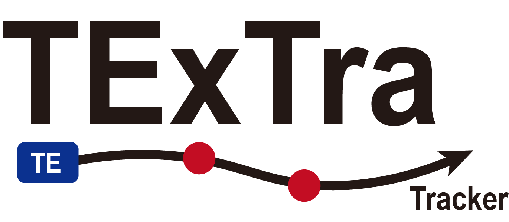

<p align="center">
  
</p>

# TExTra

**TExTra** (**TE-overlapping Exon Tracker**) identifies, classifies, quantifies, and compares transposable element (TE)-overlapping exons from short-read RNA-seq data. It combines consensus transcript assembly, splice-junction evidence, HITindex positional classification, and transcript abundance estimation to support locus-specific TE-overlapping exon analysis.

## Contents

* [Overview](#overview)
* [System Requirements](#system-requirements)
* [Installation](#installation)
  * [Conda](#option-1-conda)
  * [Docker](#option-2-docker)
* [Demo](#demo)
  * [Run demo with Conda](#run-demo-with-conda)
  * [Run demo with Docker](#run-demo-with-docker)
  * [Expected demo output](#expected-demo-output)
* [Instructions for Use](#instructions-for-use)
  * [1. Prepare inputs](#1-prepare-inputs)
  * [2. Run the upstream workflow](#2-run-the-upstream-workflow)
  * [3. Run differential usage analysis](#3-run-differential-usage-analysis)
* [Documentation](#documentation)
* [Troubleshooting](#troubleshooting)
* [Citation](#citation)

## Overview

TExTra takes RNA-seq inputs plus genome-matched gene and TE annotations, and outputs TE-overlapping exon annotations, usage tables, and optional differential-usage results.

1. `prep`: map reads, assemble a consensus transcriptome, assign transcripts to reference genes, and convert gene/TE annotations.
2. `qual`: identify TE-overlapping exons, annotate splice-site-associated TE overlap, and optionally add HITindex positional evidence.
3. `quant`: quantify transcript abundance with RSEM or Salmon and project transcript abundance to TE-overlapping exon usage.
4. `diff`: test differential TE-overlapping exon usage between two groups, with optional coding-potential prediction for transcripts containing candidate events.

Convenience workflows are also provided:

* `upstream`: run `prep + qual + quant`.
* `test`: run `prep + qual + quant + diff` on a small test dataset.


## System Requirements

### Operating system

TExTra is designed for Linux/Unix-like systems.

Tested system:

* CentOS Linux 7.9, x86_64
* glibc 2.17
* Conda environment created with Python 3.8

The Docker image runs TExTra inside a Linux container and should work on Linux, macOS, or Windows hosts with Docker installed.

### Hardware

No non-standard hardware or GPU is required.

CPU, memory, and disk requirements scale with the size of the RNA-seq dataset and reference genome.

### Software dependencies

The full reproducible environment, including software version constraints, is defined in [environment.yml](environment.yml). TACO and PLEK2 are vendored under `util/external/` in this Docker release.

## Installation

TExTra can be installed with Conda or run through Docker.

Typical Conda install time on a normal desktop or workstation is approximately 10-30 minutes, depending mainly on dependency download speed and Conda solver performance. In our source-install test, creating the Conda environment took 9.2 minutes and `pip install .` took 5 seconds with several packages already cached. Docker build time is typically longer on first build because the image installs the same Conda environment and downloads bundled demo/external resources.

### Option 1: Conda

Clone the repository:

```bash
git clone https://github.com/iukoi77-oas/TExTra.git
cd TExTra
```

Create and activate the environment:

```bash
conda env create -n TExTra -f environment.yml
conda activate TExTra
```

Install TExTra:

```bash
pip install -e .
```

Verify the installation:

```bash
TExTra --help
```

#### External tools

TExTra uses TACO for the optional TACO transcript merge backend and PLEK2 for `TExTra diff --ncpred`. These tools can be provided in any of the following ways.

1. Place them under the default repository path:

```text
util/external/taco*/taco_run
util/external/PLEK*/PLEK2.py
```

2. Set `TEXTRA_EXTERNAL_DIR` to a shared external-tool directory:

```bash
export TEXTRA_EXTERNAL_DIR=/path/to/external_tools
```

The directory should contain paths such as:

```text
/path/to/external_tools/taco*/taco_run
/path/to/external_tools/PLEK*/PLEK2.py
```

3. Provide paths directly at runtime:

```bash
TExTra prep ... --taco-path /path/to/taco_or_taco_run
TExTra diff ... --ncpred --plek-path /path/to/PLEK_or_PLEK2.py
```

The bundled external-tool archives can be downloaded from [Zenodo](https://zenodo.org/records/21485736). For default discovery, place the downloaded archives under `util/external/`, then extract them and decompress the PLEK2 model files:

```bash
cd util/external

tar -xzvf taco-v0.7.3.Linux_x86_64.tar.gz
tar -xzvf PLEKv2_allfiles_240807.tar.gz

cd PLEK*
bunzip2 Coding_Net_kmer6_orf_Arabidopsis.h5.bz2
bunzip2 Coding_Net_kmer6_orf.h5.bz2
```

Ensure that TACO and PLEK2 are installed and executable:

* `taco_run` should be located under `taco*/`.
* `PLEK2.py` should be located under `PLEK*/`.

Alternatively, TACO can be installed from [GitHub/TACO](https://github.com/tacorna/taco), and PLEK2 can be installed from [SourceForge/PLEK2](https://sourceforge.net/projects/plek2/).

### Option 2: Docker

Use the prebuilt image from GitHub Container Registry:

```bash
docker pull --platform linux/amd64 ghcr.io/iukoi77-oas/textra:v1.1.0
```

The current Docker image is built for `linux/amd64`. On Apple Silicon Macs, keep `--platform linux/amd64`; the image will run through emulation and may be slower than on a native Linux x86_64 machine.

Docker image pull time is not included in the demo runtime because it depends mainly on network speed and registry connectivity. The image includes the Conda runtime, TACO, PLEK2, and bundled demo data, so the first pull can be large. In our Apple Silicon Mac test, pulling the `linux/amd64` image from GHCR took approximately 40 minutes over the tested network. If the pull fails with `unexpected EOF`, rerun the same `docker pull` command; Docker will reuse completed layers.

Show the TExTra help:

```bash
docker run --rm --platform linux/amd64 ghcr.io/iukoi77-oas/textra:v1.1.0 --help
```

To build the Docker image locally from the repository root:

```bash
docker build -t textra:1.1.0 .
```

During local Docker build, TACO, PLEK2, and the bundled demo data are downloaded from [Zenodo](https://zenodo.org/records/21485736) and included in the final image. The build therefore requires network access to Zenodo.

For real analyses, keep FASTQ/BAM/reference files on the host machine and make the required directories available inside the container with Docker volume mounts (`-v`). Write outputs to a mounted host directory so results remain available after the container exits.

## Demo

The demo uses a small chr18 subset of simulated mouse heart developmental RNA-seq data. The reads are paired-end and reverse-stranded (`rf`). The test data include:

* Paired-end RNA-seq FASTQ files derived from simulated BAM files.
* Reference genome annotation (GTF): GENCODE vM21 primary assembly annotations.
* TE annotation: RepeatMasker-based mouse TE annotations.
* Reference genome FASTA: GRCm38 primary assembly.

In the Docker release, the demo data are already included under `test/example_data/`. For Conda/source installations, the test data can be downloaded from [Zenodo](https://zenodo.org/records/21485736), then placed under `test/example_data/` or supplied with `--test-data-dir`.

```text
test/
├── input.tsv
└── example_data/
    ├── fastq/
    ├── reference.fa
    ├── gencode.vM21.gtf
    └── TE_rmsk.gtf
```

### Run demo with Conda

```bash
conda activate TExTra

TExTra test
```

If the test data are stored elsewhere, provide the directory explicitly:

```bash
TExTra test --test-data-dir /path/to/example_data
```

### Run demo with Docker

```bash
docker run --rm \
  --platform linux/amd64 \
  -v "$PWD/test_result:/result" \
  ghcr.io/iukoi77-oas/textra:v1.1.0 \
  test --out_dir /result --threads 8 --njobs 1
```

The `--njobs 1` setting runs sample-level jobs sequentially and reduces peak memory use in Docker Desktop. For Docker Desktop, allocate at least 8 GB memory; 12 GB or more is recommended for the bundled demo. If STAR is killed with `SIGKILL` during the demo, increase Docker memory or rerun with `--njobs 1`. If memory is still constrained, use `--threads 2 --njobs 1`.

### Expected demo output

The Conda demo writes results under `test/result/`. The Docker example above writes results to the mounted host directory `test_result/`.

| Path | Description |
| --- | --- |
| `00_convert/` | Converted gene and TE BED annotations used by downstream modules. |
| `01_alignment/` | Alignment outputs used by transcript assembly and junction evidence. |
| `02_assembly/` | Consensus transcript assembly and transcript-to-gene assignment. |
| `03_classify/` | TE-overlapping exon annotation and HITindex-derived positional evidence. |
| `04_quantification/` | Transcript abundance and TE-overlapping exon usage tables. |
| `05_downstream/` | Differential usage results and optional downstream analyses. |
| `logs/` | Module logs and debug configuration files when debug mode is enabled. |
| `TExTra.config.json` | Run configuration shared across modules. |

Key expected result files include:

| File | Main contents |
| --- | --- |
| `02_assembly/consensus_transcripts.gtf` | Consensus transcript models assembled from the test RNA-seq data. Important attributes include `transcript_id` and `gene_id`. |
| `03_classify/project.TE_overlap.exon.tsv` | TE-overlapping exon events. Key columns include `exon_id` (genomic exon coordinate), `gene_id`, `transcript_id`, `te_overlap_label`, `te_boundary_side`, `ID_position_summary`, and `candidate_TE_event`. |
| `04_quantification/project.TE_overlap.exon_usage.tsv` | TE-overlapping exon usage values across samples. Key columns include `exon_id`, sample usage columns, `gene_id`, `transcript_id`, `te_overlap_label`, `ID_position_summary`, and `candidate_TE_event`. |
| `05_downstream/DE/differential_significant_usage.tsv` | Significant differential TE-overlapping exon usage results. Key columns include `exon_id`, `group1`, `group2`, `mean_usage_group1`, `mean_usage_group2`, `delta_usage`, `higher_usage_group`, `pvalue`, and `padj`. |

Expected demo runtime on a normal multi-core desktop/workstation is approximately 20-40 minutes. In our Linux source-install test, `TExTra test` completed in 18.3 minutes with the default 4-thread RSEM demo settings. For the Docker demo on Apple Silicon Docker Desktop with 8 CPUs and 8 GB memory, the expected runtime is approximately 40 minutes with `--threads 8 --njobs 1`; this estimate excludes the initial image pull. Docker runtime depends on the host platform and Docker resource limits; Apple Silicon Macs run the current `linux/amd64` image through emulation and may be slower. Runtime is dominated by read alignment, HITindex model fitting, and RSEM/Salmon quantification. The exact runtime depends on CPU count, disk speed, memory limits, selected quantifier, and whether external indexes or intermediate results are reused.

## Instructions for Use

### 1. Prepare inputs

Prepare an input TSV where the first column is the sample/condition name and the remaining columns are biological replicates.

Paired-end FASTQ example:

```text
heart_14d    rep1_R1.fastq.gz,rep1_R2.fastq.gz    rep2_R1.fastq.gz,rep2_R2.fastq.gz
heart_2m     rep1_R1.fastq.gz,rep1_R2.fastq.gz    rep2_R1.fastq.gz,rep2_R2.fastq.gz
```

BAM inputs are also supported:

```text
heart_14d    ENCFF014ZHD.bam    ENCFF890XGT.bam
heart_2m     ENCFF997DFX.bam    ENCFF100LXH.bam
```

Also prepare genome-matched reference files:

```text
genome.fa
gene.gtf
TE_annotation
```

`TE_annotation` can be `.gtf`, `.gff`, `.bed`, or RepeatMasker `.out`/`.txt`. Ensure that chromosome names are consistent across the genome FASTA, gene GTF, and TE annotation.

### 2. Run the upstream workflow

```bash
TExTra upstream \
  --input input.tsv \
  --out_dir result \
  --genome genome.fa \
  --gene gene.gtf \
  --te TE_annotation
```

This runs `prep`, `qual`, and `quant` and writes assembly, classification, and quantification outputs under `result/`.

### 3. Run differential usage analysis

```bash
TExTra diff \
  --prep result \
  --quant result \
  --out_dir result \
  --groups heart_14d,heart_2m
```

By default, significant events satisfy `abs(delta_usage) > 0.1` and `padj < 0.05`.

To add coding-potential prediction for transcripts containing significant events:

```bash
TExTra diff \
  --prep result \
  --quant result \
  --out_dir result \
  --groups heart_14d,heart_2m \
  --ncpred \
  --genome genome.fa
```

For module-specific parameters, separate-module execution, output files, and column definitions, see the documentation below.

## Documentation

Module-specific options, outputs, and output-column definitions are documented by module:

* [00 - TExTra upstream](docs/00_upstream.md)
* [01 - TExTra prep](docs/01_prep.md)
* [02 - TExTra qual](docs/02_qual.md)
* [03 - TExTra quant](docs/03_quant.md)
* [04 - TExTra diff](docs/04_diff.md)

Default mode writes only core result files and concise logs. Use:

* `--detail` for additional result-checking tables and evidence columns.
* `--debug` for detail outputs plus selected intermediate files, module configs, and aggregated external-tool logs.

## Troubleshooting

* **Chromosome mismatch**: Genome FASTA, gene GTF, and TE annotation must use consistent chromosome names.
* **Input formatting**: Use a tab-separated input file and comma-separated mates for paired-end FASTQ.
* **Sample/group names**: Names used in `--samples` and `--groups` must match the first column of the input TSV and the quant sample-column prefixes.
* **Conda solver issues**: Try `conda config --set channel_priority flexible`.
* **PLEK2 import errors**: Confirm the environment includes TensorFlow 2.4.1, Keras 2.4.3, h5py 2.10.0, regex, and Biopython.

## Citation

TExTra is currently in preparation. If you use this software in your research, please cite:

> **TExTra enables locus-specific quantification of transposable element-derived exonization from short-read RNA-seq.** *Yanjing et al. (2026). In preparation.*
